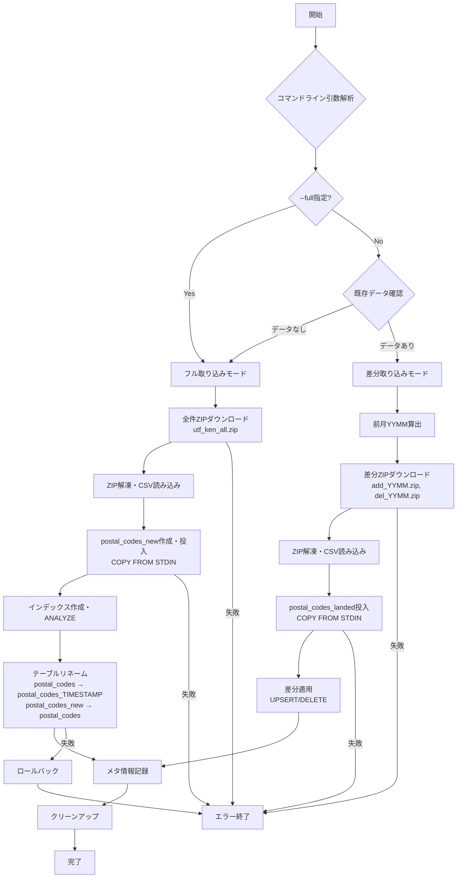

# PgPostalCodeSync レビュー＆ブラッシュアップ

## 処理フロー (Mermaid)

## 開発工数見積

### タスク別見積（人日）

| タスク | 概要 | 見積 |
|--------|------|------|
| **基盤構築** | DI・設定・ログ設定 | 0.5日 |
| **DownloadService** | HTTP通信・ZIP処理 | 1.0日 |
| **DatabaseService** | PostgreSQL接続・COPY FROM STDIN | 1.5日 |
| **PostalCodeSyncService** | メイン制御・フロー管理 | 1.5日 |
| **モデル・設定クラス** | データクラス・設定管理 | 0.5日 |
| **コマンドライン解析** | 引数処理・ヘルプ表示 | 0.5日 |
| **単体テスト** | 主要ロジックのテスト | 1.0日 |
| **結合テスト** | 実際のファイルでの動作確認 | 0.5日 |
| **ドキュメント** | README更新・運用手順 | 0.5日 |

**合計見積**: **7.5人日**

### フェーズ別工数配分
- **Phase1** (基本機能): 5.0人日
- **Phase2** (テスト・品質確保): 1.5人日  
- **Phase3** (ドキュメント・仕上げ): 1.0人日

## 安全にリリースするための段階的な機能アップデート方針

### Phase1: 基本実装
- [x] **要件定義・設計完了**
- [ ] **差分取り込み機能**
  - 月次差分ファイル処理
  - PostgreSQL投入
  - 基本エラーハンドリング
- [ ] **フル取り込み機能**  
  - 全件ファイル処理
  - テーブルリネーム切り替え
- [ ] **設定管理・ログ出力**

### Phase2: 品質・テスト強化
- [ ] **単体テスト追加**
  - ダウンロード処理テスト
  - データベース処理テスト
- [ ] **結合テスト**
  - 実際の郵便データでの動作確認
  - エラーケースの動作確認
- [ ] **運用テスト**
  - 外部スケジューラ連携確認

### Phase3: 運用準備
- [ ] **監視・運用対応**
  - ログレベル調整
  - エラー通知仕組み
- [ ] **ドキュメント整備**
  - 運用手順書
  - トラブルシューティングガイド
- [ ] **初回データ投入**
  - 本番環境での初期データ取り込み

### リスク軽減策
1. **段階的リリース**: テスト環境→ステージング→本番
2. **ロールバック準備**: 旧テーブルの保持（タイムスタンプ付き）
3. **監視強化**: 初回実行時は手動監視
4. **データ検証**: 取り込み後のレコード数・整合性確認

## 未確定事項（要確認ラベル付き）

### 🔍 **[要確認]** 運用・環境関連

1. **本番データベース接続情報**
   - 接続先PostgreSQLサーバーの詳細
   - 認証方法（パスワード/証明書認証）
   - ネットワーク接続許可設定

2. **実行スケジュール**
   - 月次実行の具体的な日時（月初何日の何時？）
   - 実行環境（Windows/Linux）
   - スケジューラツール（Task Scheduler/cron）

3. **作業ディレクトリ**
   - 本番環境での作業ディレクトリパス
   - 必要ディスク容量（ZIP展開用）
   - アクセス権限設定

### 🔍 **[要確認]** エラー処理・監視

4. **エラー通知方法**
   - 処理失敗時の通知先・方法
   - ログ監視の仕組み
   - アラート設定

5. **データ保持ポリシー**
   - 旧テーブル（タイムスタンプ付き）の保持期間
   - 作業用一時ファイルの削除タイミング
   - ログファイルのローテーション・保持期間

### 🔍 **[要確認]** 初回データ投入

6. **既存データの扱い**
   - 現在のext.postal_codesテーブルの状態
   - 初回実行時の動作（差分/フル取り込み）
   - データ移行の必要性

7. **性能要件**
   - 処理時間の上限（SLA）
   - 同時実行制限の必要性
   - リソース使用量の制限

### 📋 **TODO**: 次回確認事項
- [ ] 本番環境の詳細仕様確認
- [ ] 運用チームとの要件すり合わせ  
- [ ] 初回データ投入計画の策定
- [ ] 監視・アラート設定の検討