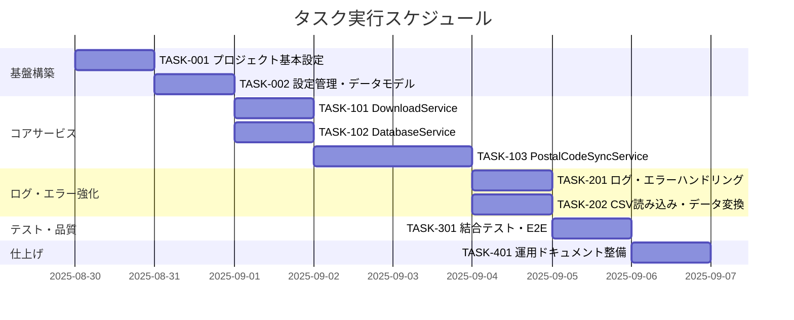

# postal-code-sync 実装タスク

## 概要

全タスク数: 12  
推定作業時間: 7.5人日  
クリティカルパス: TASK-001 → TASK-002 → TASK-101 → TASK-102 → TASK-103 → TASK-201 → TASK-301

## タスク一覧

### フェーズ1: 基盤構築（1.0人日）

#### TASK-001: プロジェクト基本設定・DI設定

- [x] **タスク完了**
- **タスクタイプ**: DIRECT  
- **要件リンク**: 設計方針全体
- **依存タスク**: なし
- **実装詳細**:
  - Program.cs の .NET 9 汎用ホスト設定
  - DI コンテナ設定（Serilog, Npgsql, HttpClient）
  - appsettings.json の初期設定
- **テスト要件**:
  - [ ] DI コンテナ解決テスト
  - [ ] 設定読み込みテスト
- **完了条件**:
  - [ ] プログラムが正常起動する
  - [ ] 設定値が正しく読み込まれる

#### TASK-002: 設定管理・データモデル作成

- [x] **タスク完了**
- **タスクタイプ**: DIRECT
- **要件リンク**: FR-001〜FR-007
- **依存タスク**: TASK-001
- **実装詳細**:
  - AppSettings.cs の設定クラス作成
  - PostalCodeRecord.cs のデータモデル作成
  - コマンドライン引数解析（Aloe.Utils.CommandLine）
- **テスト要件**:
  - [ ] 設定バインディングテスト
  - [ ] コマンドライン引数解析テスト
- **完了条件**:
  - [ ] 設定が正しく取得できる
  - [ ] コマンドライン引数が正しく解析される

### フェーズ2: コアサービス実装（3.5人日）

#### TASK-101: DownloadService 実装

- [x] **タスク完了**
- **タスクタイプ**: TDD
- **要件リンク**: FR-001, FR-002
- **依存タスク**: TASK-002
- **実装詳細**:
  - HttpClient によるZIPファイルダウンロード
  - ファイル検証（サイズ・存在確認）
  - ZIP解凍処理
  - 一時ファイル管理
- **テスト要件**:
  - [ ] 単体テスト: ダウンロード処理
  - [ ] 単体テスト: ZIP解凍処理
  - [ ] 統合テスト: 実際のファイルダウンロード
- **エラーハンドリング**:
  - [ ] ネットワークエラー
  - [ ] ファイル破損
  - [ ] ディスク容量不足
- **完了条件**:
  - [ ] utf_ken_all.zip ダウンロード成功
  - [ ] add/del ZIP ファイルダウンロード成功
  - [ ] ZIP解凍成功

#### TASK-102: DatabaseService 実装

- [x] **タスク完了**
- **タスクタイプ**: TDD
- **要件リンク**: FR-003, QR-001, QR-002
- **依存タスク**: TASK-002
- **実装詳細**:
  - PostgreSQL接続管理
  - COPY FROM STDIN によるバルク投入
  - テーブルリネーム処理
  - メタ情報管理（ingestion_runs/files）
- **テスト要件**:
  - [ ] 単体テスト: データベース接続
  - [ ] 単体テスト: COPY FROM STDIN
  - [ ] 単体テスト: テーブルリネーム
  - [ ] 統合テスト: 実際のデータ投入
- **エラーハンドリング**:
  - [ ] 接続エラー
  - [ ] トランザクションロールバック
  - [ ] テーブル作成失敗
- **完了条件**:
  - [ ] ext.postal_codes_landed への投入成功
  - [ ] テーブルリネーム処理成功
  - [ ] メタ情報記録成功

#### TASK-103: PostalCodeSyncService 実装

- [x] **タスク完了**
- **タスクタイプ**: TDD
- **要件リンク**: FR-004, FR-005, QR-003
- **依存タスク**: TASK-101, TASK-102
- **実装詳細**:
  - メイン制御ロジック
  - 差分・フル取り込み判定
  - 前月YYMM算出
  - クリーンアップ処理
- **テスト要件**:
  - [ ] 単体テスト: 取り込みモード判定
  - [ ] 単体テスト: 年月算出
  - [ ] 単体テスト: クリーンアップ処理
  - [ ] 統合テスト: エンドツーエンドフロー
- **エラーハンドリング**:
  - [ ] 処理中断時のクリーンアップ
  - [ ] ロールバック処理
  - [ ] 適切な終了コード設定
- **完了条件**:
  - [ ] 差分取り込みフロー動作
  - [ ] フル取り込みフロー動作
  - [ ] エラー時クリーンアップ動作

### フェーズ3: ログ・エラーハンドリング強化（1.5人日）

#### TASK-201: ログ出力・エラーハンドリング強化

- [x] **タスク完了**
- **タスクタイプ**: TDD
- **要件リンク**: FR-006, FR-007
- **依存タスク**: TASK-103
- **実装詳細**:
  - Serilog構造化ログ設定
  - ファイル・コンソール出力
  - エラー詳細記録
  - 処理進捗ログ
- **テスト要件**:
  - [ ] 単体テスト: ログ出力確認
  - [ ] 単体テスト: 終了コード検証
  - [ ] 統合テスト: エラーシナリオ
- **ログ要件**:
  - [ ] 処理開始・終了ログ
  - [ ] ダウンロード進捗ログ
  - [ ] データベース操作ログ
  - [ ] エラー詳細ログ
- **完了条件**:
  - [ ] 適切なログレベル出力
  - [ ] エラー時非0終了コード
  - [ ] ログファイルローテーション

#### TASK-202: CSV読み込み・データ変換処理

- [x] **タスク完了**
- **タスクタイプ**: TDD
- **要件リンク**: FR-002, FR-003
- **依存タスク**: TASK-103
- **実装詳細**:
  - UTF-8 CSV読み込み
  - PostalCodeRecord へのマッピング
  - データ検証・サニタイゼーション
- **テスト要件**:
  - [ ] 単体テスト: CSV解析
  - [ ] 単体テスト: データマッピング
  - [ ] 単体テスト: 不正データハンドリング
- **データ検証要件**:
  - [ ] 必須フィールドチェック
  - [ ] 郵便番号形式検証
  - [ ] 文字エンコーディング確認
- **完了条件**:
  - [ ] 正常CSV読み込み成功
  - [ ] データ変換成功
  - [ ] 不正データ適切処理

### フェーズ4: テスト・品質確保（1.0人日）

#### TASK-301: 結合テスト・E2Eテスト

- [ ] **タスク完了**
- **タスクタイプ**: TDD
- **要件リンク**: 全要件
- **依存タスク**: TASK-201, TASK-202
- **実装詳細**:
  - 実際の郵便データでの結合テスト
  - コマンドライン実行テスト
  - エラーシナリオテスト
- **テスト要件**:
  - [ ] E2E: フル取り込みフロー
  - [ ] E2E: 差分取り込みフロー
  - [ ] E2E: エラー処理フロー
  - [ ] パフォーマンステスト
- **テストシナリオ**:
  - [ ] 初回実行（データなし→フル取り込み）
  - [ ] 2回目実行（差分取り込み）
  - [ ] --full強制フル取り込み
  - [ ] ネットワークエラー時
- **完了条件**:
  - [ ] 全テストケースパス
  - [ ] パフォーマンス要件満足
  - [ ] エラー処理動作確認

### フェーズ5: ドキュメント・仕上げ（0.5人日）

#### TASK-401: 運用ドキュメント・README整備

- [ ] **タスク完了**
- **タスクタイプ**: DIRECT
- **要件リンク**: 運用要件全体
- **依存タスク**: TASK-301
- **実装詳細**:
  - README.md の更新
  - 運用手順書作成
  - トラブルシューティングガイド
- **ドキュメント要件**:
  - [ ] セットアップ手順
  - [ ] 実行方法・引数説明
  - [ ] 設定ファイル説明
  - [ ] エラー対応手順
- **完了条件**:
  - [ ] 運用者がドキュメント通り実行可能
  - [ ] トラブル対応手順整備完了

## 実行順序

## マイルストーン

- **M1 (Day 2)**: 基盤構築完了
- **M2 (Day 5)**: コアサービス実装完了
- **M3 (Day 7)**: ログ・エラーハンドリング完了
- **M4 (Day 8)**: 全機能統合・テスト完了

## 並行実行可能タスク

- **Phase2**: TASK-101（DownloadService）と TASK-102（DatabaseService）は並行実装可能
- **Phase3**: TASK-201（ログ強化）と TASK-202（CSV処理）は並行実装可能

## クリティカルパス

**TASK-001** → **TASK-002** → **TASK-103** → **TASK-301** → **TASK-401**

PostalCodeSyncService（TASK-103）が全体の中核となるため、依存関係の中心となります。